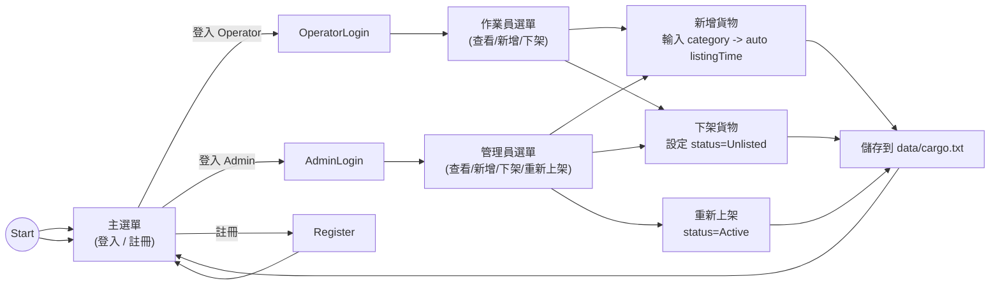

# 智慧物流與倉庫管理系統 (Smart Warehouse & Logistics Management System)

這是一個以 C++17 開發的終端機互動式 (TUI) 物流與倉庫管理系統。本系統專門設計用以展示 C++ 的**物件導向程式設計 (OOP)**、**類別繼承與多型**、**STL 類別庫**以及**檔案 I/O（持久化儲存）** 等核心技術。

---

## 🚀 專案特點與 C++ 技術呈現

### 1. 物件導向繼承與多型 (Inheritance & Polymorphism)
專案內的核心架構展現了深刻的 OOP 繼承與多型特性：
*   **貨物類別關係**：
    *   `Cargo`（基底類別）：定義貨物基本屬性（名稱、重量、容積、基本費率、擁有者）。
    *   `DangerousCargo`（危險品）：繼承自 `Cargo`，新增危險等級與 UN 編號。重寫 `calculateStorageFee()` 加上安全保險與監控費，重寫 `printDetails()` 顯示危險品警告。
    *   `PerishableCargo`（易腐品）：繼承自 `Cargo`，新增過期日與溫控 (°C) 屬性。依據溫控區間（如冷凍/冷藏）動態加收冷鏈電費。
    *   `FragileCargo`（易碎品）：繼承自 `Cargo`，新增包裝型態與堆疊層數限制。若高度限制太低，則加收倉庫地板佔用費。
*   **多型應用**：
    在 `Warehouse::calculateTotalRevenue()` 與 `TUI::listInventory()` 中，系統只需維護一個統一的基底指標容器 `std::vector<std::shared_ptr<Cargo>>`，便能在執行期（Runtime）透過**動態綁定 (Dynamic Binding)**，自動呼叫各衍生類別特定的費率計算與明細輸出。

### 2. 使用者權限管制 (Role-Based Access Control)
*   `User` 作為基底類別，衍生出 `AdminUser`（管理員）與 `RegularUser`（一般作業員）。
*   透過 `canManageInventory()` 與 `canManageUsers()` 虛擬方法，管制不同角色登入後的終端機選單權限。

### 3. STL 類別庫應用
*   **容器 (Containers)**：使用 `std::vector` 存放庫存列表，使用 `std::string` 處理字串。
*   **智慧指標 (Smart Pointers)**：全面使用 `std::shared_ptr` 與 `std::make_shared` 管理動態記憶體，防止記憶體洩漏 (Memory Leaks)。
*   **演算法 (Algorithms)**：使用 `std::find_if` 與 `Lambda 運算式` 進行高效率的貨物 ID 與帳號查找。

### 4. 檔案讀寫與持久化儲存 (File I/O)
*   使用 `std::ifstream` 與 `std::ofstream` 實作資料的儲存與讀取。
*   採用簡易的 **CSV 格式**，程式啟動時會解析逗號分隔值並**動態重構 (Downcasting/Deserialization)** 回正確的子類別物件實例；關閉時會自動寫入 `data/cargo.txt` 與 `data/users.txt`。
*   **防呆機制**：若系統找不到 `users.txt`，會自動寫入預設的管理員帳密，避免系統崩潰。

### 5. 精美終端機 UI (TUI) 與防呆
*   使用 **ANSI Escape Codes** 彩色化輸出終端機介面（危險品紅字警示、成功綠字提示等）。
*   實作健壯的輸入防呆函式（`readInt` 與 `readDouble`），防止使用者輸入中文字元或英文字母時，導致標準輸入流 `cin` 發生無窮迴圈或崩潰。

---

## 📁 檔案結構說明

```text
├── CMakeLists.txt         # CMake 編譯設定檔
├── README.md              # 系統開發說明文件 (本檔案)
├── data/
│   ├── cargo.txt          # 貨物資料庫 (CSV 格式)
│   └── users.txt          # 使用者帳號資料庫 (CSV 格式)
└── src/
    ├── Cargo.h / .cpp           # 貨物基底類別
    ├── DangerousCargo.h / .cpp  # 危險品衍生類別
    ├── PerishableCargo.h / .cpp # 易腐品衍生類別
    ├── FragileCargo.h / .cpp    # 易碎品衍生類別
    ├── User.h / .cpp            # 使用者權限管制類別 (基底與衍生)
    ├── Warehouse.h / .cpp       # 倉庫核心管理類別 (STL 容器與統計邏輯)
    ├── Database.h / .cpp        # 檔案 I/O 資料讀寫處理器
    ├── TUI.h / .cpp             # 互動式彩色終端機介面
    └── main.cpp                 # 系統程式主入口
```

---

## 🛠️ 如何編譯與執行

本專案支援 CMake 編譯，或直接使用 g++ 編譯。

### 方法一：使用 g++ 直接編譯 (推薦，極速簡便)
在專案根目錄下打開終端機（PowerShell 或 CMD），輸入以下指令：
```bash
g++ -std=c++17 src/*.cpp -o WarehouseSystem
```
編譯完成後，執行產生的執行檔：
```bash
.\WarehouseSystem.exe
```

### 方法二：使用 CMake 編譯
```bash
cmake -B build
cmake --build build
```
編譯完成後，執行檔將位於 `build/` 目錄中。

---

<<<<<<< HEAD
## 🧭 開發迭代流程
本專案採用簡潔的迭代式開發流程，包含以下階段：

1. 需求分析
   - 定義使用者角色與系統功能：一般作業員、系統管理員、貨物管理、報表統計。
   - 確認系統需支援的貨物類型：一般貨物、危險品、易腐品、易碎品。
   - 決定資料持久化格式與讀寫流程：CSV 檔案、`data/users.txt`、`data/cargo.txt`。

2. 系統設計與架構
   - 建立類別繼承模型：`Cargo` 為基底類別，`DangerousCargo`、`PerishableCargo`、`FragileCargo` 為衍生類別。
   - 設計角色權限模型：`User`、`AdminUser`、`RegularUser`。
   - 規劃系統核心：`Warehouse` 管理庫存與使用者，`Database` 負責檔案 I/O，`TUI` 提供終端機操作介面。

3. 實作與測試
   - 先實作基礎類別與資料結構，確保多型與繼承行為正確。
   - 進行檔案讀寫功能開發，並驗證 CSV 格式可正確序列化與反序列化。
   - 開發終端機介面流程，包含登入、選單、輸入防呆與清除畫面顯示。
   - 透過重建、執行與測試各種角色流程，確認帳號驗證、貨物新增/刪除、統計報表等功能正常運作。

4. 文件與維護
   - 補齊說明文件：`README.md`、`openspec/specs/system_spec.md`、`openspec/specs/class_documentation.md`。
   - 更新開發流程、使用說明與系統規格，讓專案更容易理解與後續擴充。

---

=======
>>>>>>> origin/main
## 🔑 預設登入帳密

系統已預載兩組帳號供您展示：

1.  **管理員帳密** (具備完整權限、新增使用者與檢視統計圖表功能)：
    *   帳號：`admin`
    *   密碼：`admin123`
2.  **一般作業員帳密** (僅能查看/申報/出庫自己名下的貨物)：
    *   帳號：`user`
    *   密碼：`user123`

---

## ✨ 新增功能（本次更新）

本次更新加入：

- 貨物模型新增欄位：`category`（分類）、`listingTime`（上架時間）、`status`（Active / Unlisted）。
- 刪除貨物改為「下架（Unlist）」，保留紀錄以便日後 `Relist`（重新上架）。
- `TUI` 新增下列選項：查看下架貨物、下架貨物、重新上架貨物；新增貨物時會要求輸入分類並自動記錄上架時間。
- `Database` 的 `data/cargo.txt` 格式已擴充以儲存上述欄位，並維持向後相容性。

## 📄 `data/cargo.txt` CSV 格式說明

每一列代表一項貨物，欄位（逗號分隔）範例格式如下（新舊欄位順序）:

```
Type,ID,Name,Weight,Volume,BaseRate,Owner,Category,ListingTime,Status,TypeSpecific1,TypeSpecific2
```

範例：

```
General,C001,普通箱子,100,2,50,user,未分類,2026-06-24 17:00:00,Active
Dangerous,C002,鋰電池組,50,0.5,120,user,電子,2026-06-24 17:02:10,Active,5,UN3480
Perishable,C003,新鮮水蜜桃,200,1.2,80,user,水果,2026-07-01,4
Fragile,C004,高級水晶燈,10,0.8,100,user,家飾,2026-06-24 17:06:30,Active,木箱,1
```

> 備註：若舊檔案缺少新欄位，系統會以空字串或預設值處理（例如 `Status` 預設為 `Active`）。

## 🧭 系統流程圖 (Mermaid)

下面為系統主要流程的 Mermaid 圖示（可在支援 Mermaid 的 Markdown 查看）：



---

## 🚩 快速示範（複製貼上即可重現）

下面示範一個管理員互動流程：編譯並啟動程式、使用 `admin` 帳號登入、新增貨物（含分類選擇）、從選單下架，最後檢查下架清單。

1. 編譯並啟動（在專案根目錄執行）：

```powershell
g++ -std=c++17 src/*.cpp -o WarehouseSystem.exe
.\WarehouseSystem.exe
```

2. 選擇「系統管理員登入」，輸入帳號 `admin`、密碼 `admin123`。

3. 選單中選擇「新增貨物入庫」→ 依序輸入 ID、名稱、重量、容積、基本費率 → 在分類頁面選擇一個分類（或選「其他」自訂）→ 指派擁有人（例如 `admin`）→ 選擇貨物類型並完成。

4. 回到管理員選單，選擇「下架貨物」，系統會列出可下架的上架貨物供你選取，選取後按 `Y` 確認下架。

5. 選擇「查看下架貨物」確認該貨物狀態為 `Unlisted` 並顯示上架時間與分類資訊。

範例互動（重要輸入以大寫表示）：

```text
主選單 -> 系統管理員登入
帳號: admin
密碼: admin123
管理員選單 -> 新增貨物入庫
ID: C030
名稱: 測試流程A
重量: 5
容積: 0.2
費率: 50
分類: 選擇食品
指派擁有人: admin
類型: 普通貨物
管理員選單 -> 下架貨物 -> 選擇 C030 -> 確認: Y
管理員選單 -> 查看下架貨物 (確認 C030 狀態為 Unlisted)
```

如需我把流程圖另外輸出成 `docs/flowchart.md` 或加入專案 Wiki，請告訴我你想放的位置。

