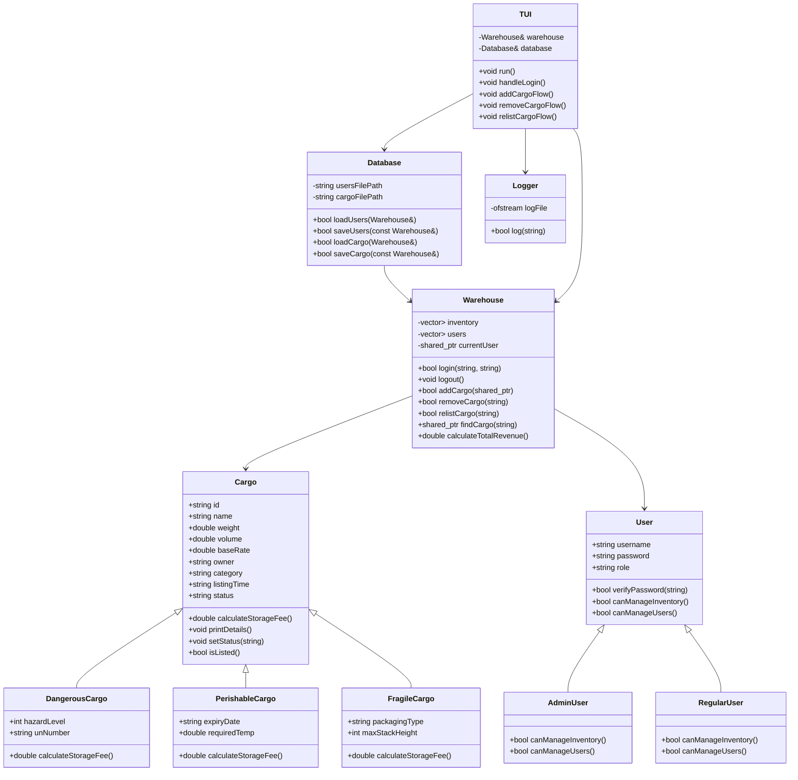
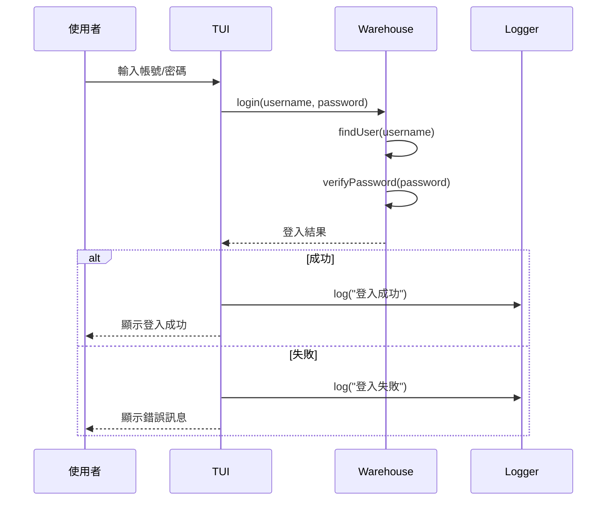
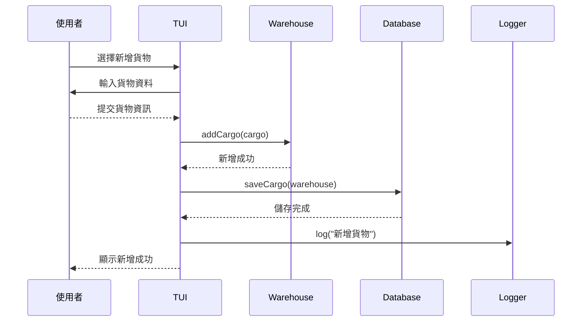

# 核心模組與 UML 圖

## 核心模組總覽

| 模組 | 說明 |
|------|------|
| `Cargo` / `Cargo.cpp` | 核心資料模型，定義貨物通用屬性與多型計費。|
| `DangerousCargo` / `DangerousCargo.cpp` | 危險品衍生類別，加入危險等級、UN 編號與額外安全費用。|
| `PerishableCargo` / `PerishableCargo.cpp` | 易腐品衍生類別，加入到期日、溫控需求與冷鏈費用計算。|
| `FragileCargo` / `FragileCargo.cpp` | 易碎品衍生類別，加入包裝型態、堆疊限制與地板佔用費。|
| `User` / `User.cpp` | 使用者基底類別，定義帳號、密碼、角色與權限檢查。|
| `Warehouse` / `Warehouse.cpp` | 倉庫核心管理，管理庫存、使用者、登入、下架、重新上架、統計。|
| `Database` / `Database.cpp` | 檔案存取與序列化，負責 CSV 讀寫與物件重建。|
| `TUI` / `TUI.cpp` | 終端機操作介面，呈現選單、輸入防呆、遮蔽密碼、顯示結果。|
| `Logger` / `Logger.cpp` | 系統日誌，記錄操作事件與稽核軌跡。|

---

## 模組說明

### Cargo 模組
- **職責**：定義貨物基本欄位與通用計費方法。
- **功能**：多型計費、詳細輸出、狀態管理（Active / Unlisted）。

### DangerousCargo / PerishableCargo / FragileCargo
- **DangerousCargo**：危險等級、UN 編號、加收安全費用。
- **PerishableCargo**：到期日、溫控需求、動態冷鏈費。
- **FragileCargo**：包裝型態、堆疊高度、地板佔用費。

### User 模組
- **職責**：帳號管理與角色授權。
- **功能**：管理員、一般作業員權限判斷；驗證密碼；權限控制。 

### Warehouse 模組
- **職責**：統一業務邏輯與資料管理。
- **功能**：新增貨物、下架、重新上架、查詢、登入、統計、角色限制。

### Database 模組
- **職責**：持久化與資料重建。
- **功能**：CSV 讀寫、向後相容、動態建立正確貨物類別。

### TUI 模組
- **職責**：終端機操作流程與使用者互動。
- **功能**：選單式輸入、遮蔽密碼、彩色提示、流程導向。 

### Logger 模組
- **職責**：操作稽核與系統日誌記錄。
- **功能**：寫入 `data/system.log`、記錄登入、註冊、新增、下架、重新上架等事件。

---

## 類別圖 (Class Diagram)

---

## 序列圖 (Sequence Diagram)

### 1. 登入流程

### 2. 新增貨物流程

---

## 使用說明

1. 開啟 `docs/core_module_diagrams.md` 於 VS Code
2. 使用 Mermaid Preview 或 Markdown Preview 擴充套件
3. 若要轉成 PDF，可直接在瀏覽器預覽後列印
