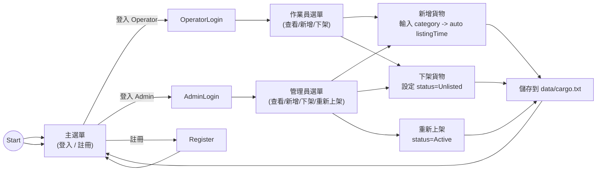

# 系統流程圖 (Flowchart)

下列 Mermaid 圖為系統主要流程，從主選單到貨物新增 / 下架 / 重新上架的流程。

```mermaid
flowchart LR
    Start((Start)) --> MainMenu["主選單\n(登入 / 註冊)"]
    MainMenu -->|登入 Operator| OperatorLogin
    MainMenu -->|登入 Admin| AdminLogin
    MainMenu -->|註冊| Register

    AdminLogin --> AdminMenu["管理員選單\n(查看/新增/下架/重新上架)"]
    OperatorLogin --> OperatorMenu["作業員選單\n(查看/新增/下架)"]

    AdminMenu --> AddCargo["新增貨物\n輸入 category -> auto listingTime"]
    AdminMenu --> Unlist["下架貨物\n設定 status=Unlisted"]
    AdminMenu --> Relist["重新上架\nstatus=Active"]

    OperatorMenu --> AddCargo
    OperatorMenu --> Unlist

    AddCargo --> SaveCSV["儲存到 data/cargo.txt"]
    Unlist --> SaveCSV
    Relist --> SaveCSV
    SaveCSV --> MainMenu
    Register --> MainMenu
    Start --> MainMenu
```

（此檔案由 README.md 中的 Mermaid 圖複製而來，方便在支援 Markdown 的檔案瀏覽器或 Wiki 中獨立顯示。）
