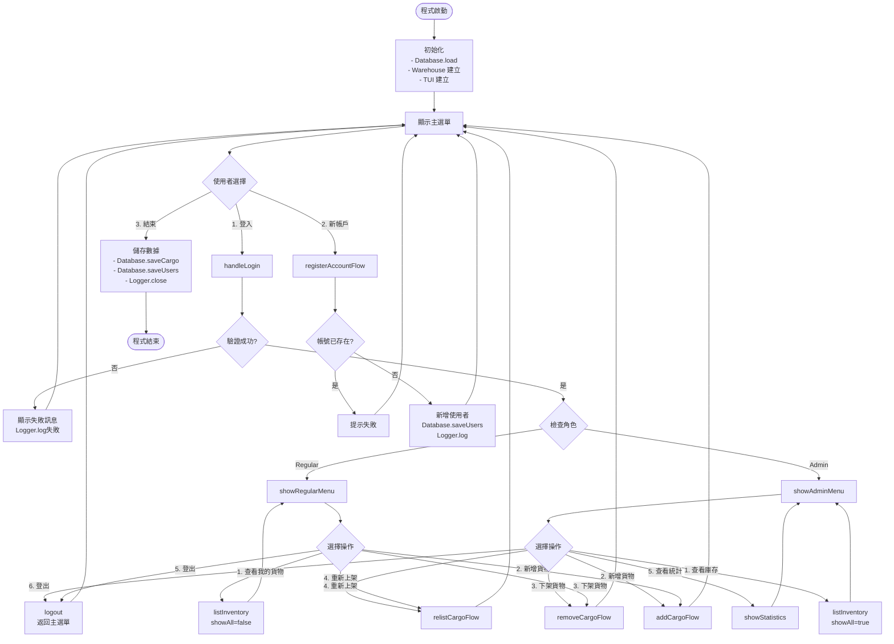
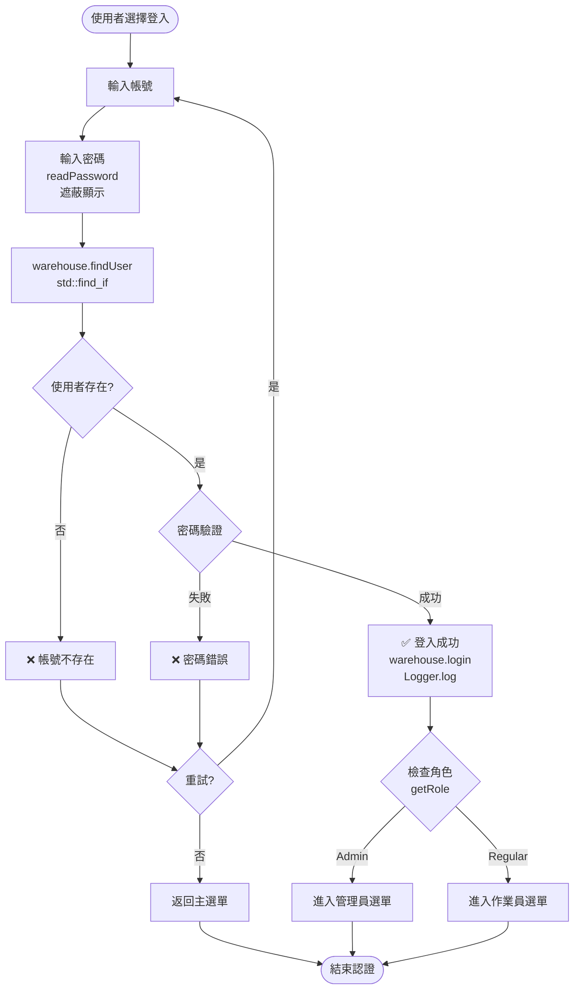
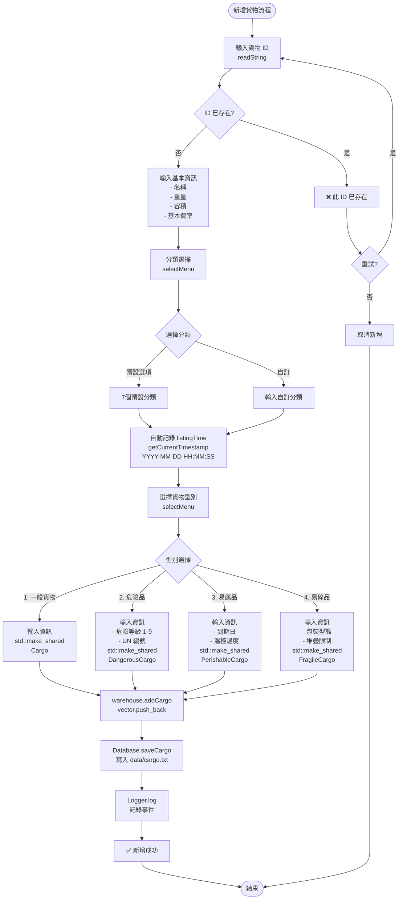
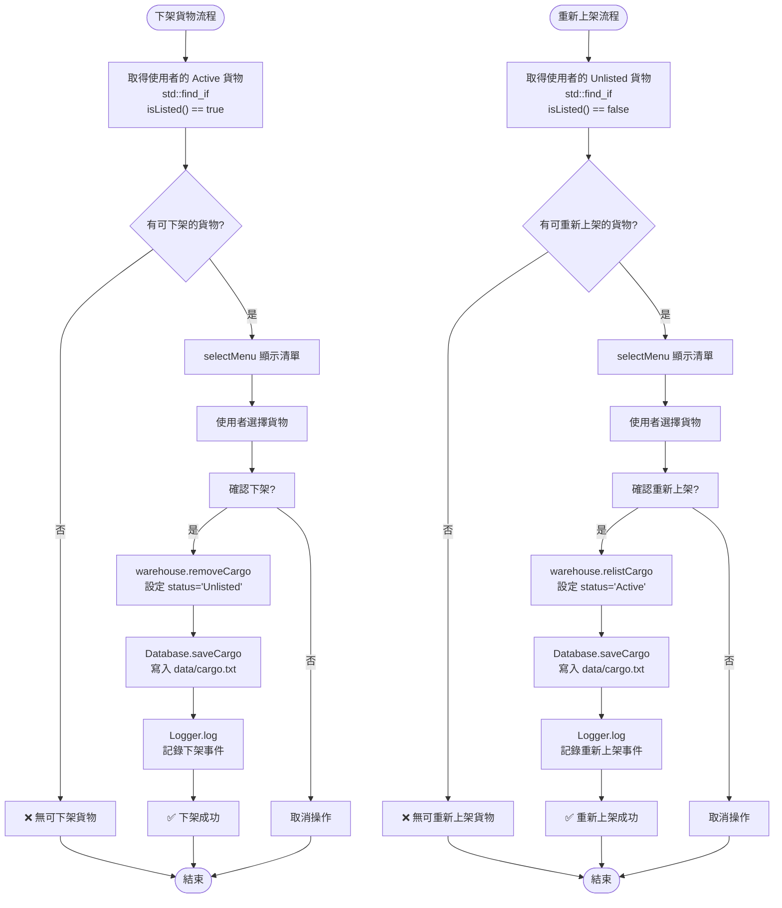
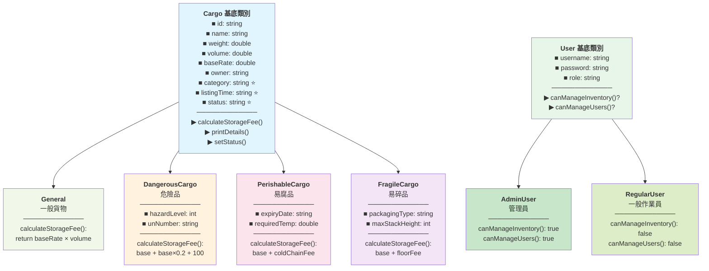
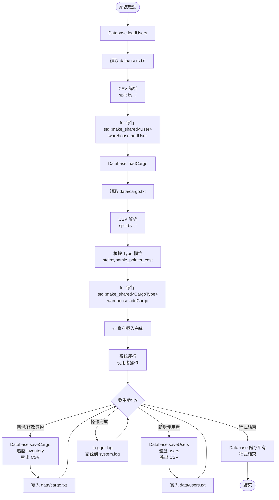
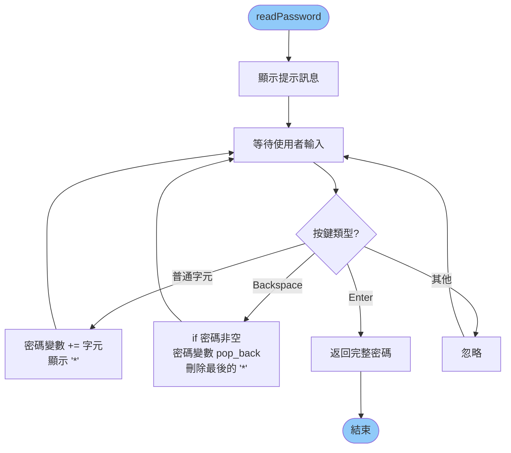
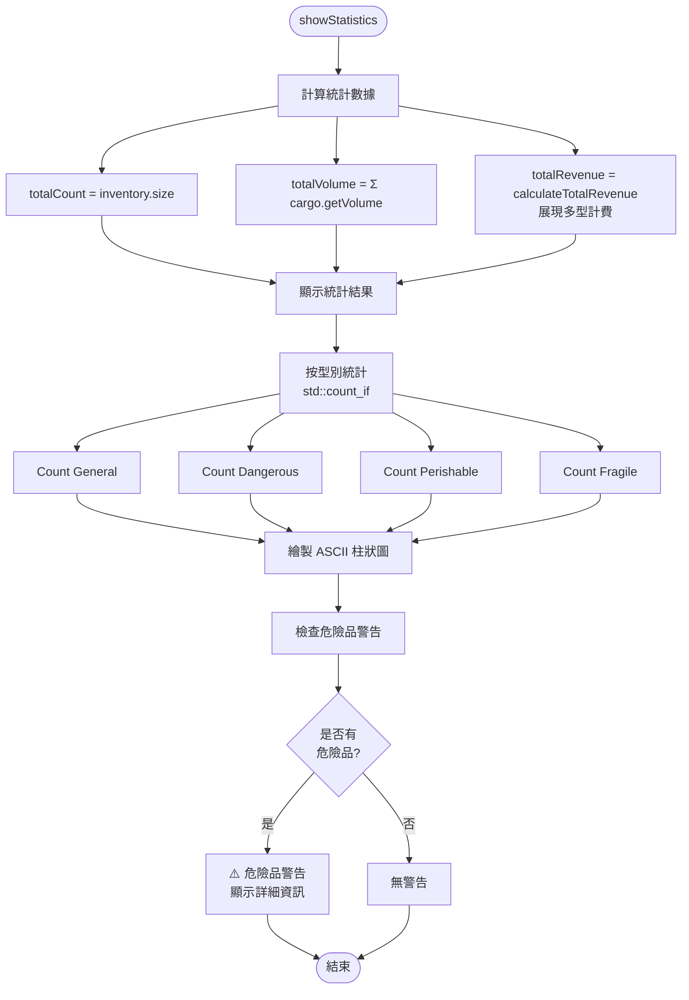

# 智慧物流系統 - Mermaid 流程圖集合

## 1. 主程式流程圖



---

## 2. 登入與認證流程



---

## 3. 新增貨物詳細流程



---

## 4. 下架與重新上架流程



---

## 5. 多型計費流程

```mermaid
flowchart TD
    Start([計算倉庫總費用]) --> Loop["for 每個 cargo in warehouse.inventory"]
    Loop --> CheckType{檢查型別<br/>cargo->getType()}
    
    CheckType -->|General| General["baseFee = baseRate × volume"]
    CheckType -->|Dangerous| Dangerous["baseFee = baseRate × volume<br/>safeFee = baseFee × 0.2<br/>monitoring = 100<br/>total = baseFee + safeFee + monitoring"]
    CheckType -->|Perishable| Perishable["baseFee = baseRate × volume<br/>tempCheck{requiredTemp}"]
    CheckType -->|Fragile| Fragile["baseFee = baseRate × volume<br/>stackCheck{maxStackHeight}"]
    
    Perishable --> TempCond{溫度條件}
    TempCond -->|≤ 0°C| ColdFee1["coldFee = baseFee × 0.3<br/>total = baseFee + coldFee"]
    TempCond -->|≤ 10°C| ColdFee2["coldFee = baseFee × 0.15<br/>total = baseFee + coldFee"]
    TempCond -->|> 10°C| NoColdFee["total = baseFee"]
    
    Fragile --> StackCond{堆疊限制}
    StackCond -->|height ≤ 2| FloorFee["floorFee = 200<br/>total = baseFee + floorFee"]
    StackCond -->|height > 2| NoFloorFee["total = baseFee"]
    
    General --> Sum["Sum += total"]
    Dangerous --> Sum
    ColdFee1 --> Sum
    ColdFee2 --> Sum
    NoColdFee --> Sum
    FloorFee --> Sum
    NoFloorFee --> Sum
    
    Sum --> NextCargo{還有更多貨物?}
    NextCargo -->|是| Loop
    NextCargo -->|否| Result["totalRevenue = Sum<br/>返回結果"]
    Result --> End([結束])
```

---

## 6. 類別層次結構圖



---

## 7. CSV 資料持久化流程



---

## 8. 密碼遮蔽輸入流程



---

## 9. 統計報表流程



---

## 使用方式

本文件包含 9 個 Mermaid 流程圖，可用於：
- 📚 系統文檔
- 🎓 課程教學
- 💼 專案簡報
- 📝 技術規格書

### 支援的格式：
- ✅ Markdown（本文件）
- ✅ GitHub / GitLab Wiki
- ✅ Notion / Confluence
- ✅ HTML（comprehensive_report.html 中已嵌入）
- ✅ PlantUML 編輯器

### 快速查看：
1. VS Code 中使用 Markdown Preview 延伸功能
2. GitHub 上直接查看此 .md 文件
3. 複製代碼到 [mermaid.live](https://mermaid.live) 線上編輯器
