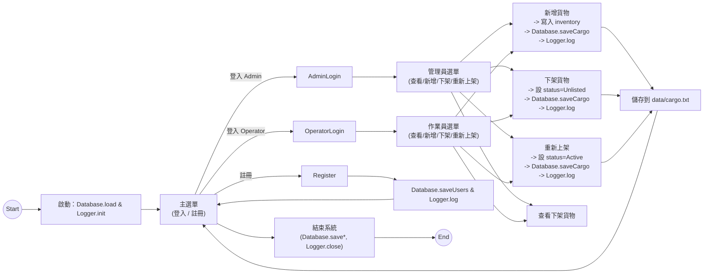

# 智慧物流與倉庫管理系統 - 專題報告

## 目錄
1. [系統特色](#系統特色)
2. [技術需求](#技術需求)
3. [核心模組](#核心模組)
4. [STL 使用重點](#stl-使用重點)
5. [開發流程](#開發流程)
6. [系統流程圖](#系統流程圖)

---

## 系統特色

### 1. 身分驗證與角色管制
- 支援**管理員**與**一般作業員**兩種角色。
- 帳號密碼登入與新帳號註冊功能。
- 基於角色的存取控制（RBAC）：不同使用者可執行不同的操作。

### 2. 貨物型別與特化處理
- 支援四種貨物型別：
  - **一般貨物 (General)**：基本屬性與標準計費。
  - **危險品 (Dangerous)**：額外記錄危險等級與 UN 編號，加收安全保險費。
  - **易腐品 (Perishable)**：紀錄到期日與溫控需求，動態加收冷鏈電費。
  - **易碎品 (Fragile)**：紀錄包裝型態與堆疊限制，若限制太低加收地板佔用費。

### 3. 分類與上架資訊追蹤
- 每筆貨物均含有：
  - `category`：分類（食品、電子、家飾等），支援自訂。
  - `listingTime`：自動記錄上架時間（精確到秒）。
  - `status`：狀態標記（Active 或 Unlisted）。

### 4. 下架可復原機制
- 傳統「刪除」改為「**下架（Unlist）**」，保留完整紀錄。
- 支援查看下架貨物清單。
- 支援「**重新上架（Relist）**」將下架貨物恢復為 Active 狀態。

### 5. 終端機互動使用者介面（TUI）
- **選單式分類**：新增貨物時以選單呈現常見分類，並允許使用者自訂。
- **遮蔽密碼輸入**：登入時密碼顯示為 `*` 符號（支援 Backspace 與 Enter）。
- **選擇式下架/重新上架**：以選單列出可選貨物，使用者直接點選。
- **彩色提示與防呆輸入**：ANSI Escape 彩色化提示、成功綠字、失敗紅字、錯誤輸入自動重新提示。

### 6. 持久化儲存與系統日誌
- **CSV 格式儲存**：
  - `data/cargo.txt`：貨物庫存（含新增欄位：Category、ListingTime、Status）。
  - `data/users.txt`：使用者帳號與角色。
  - 啟動時自動讀取，關閉前自動寫回。
- **系統日誌**：`data/system.log` 記錄所有重要事件（登入、註冊、新增/下架/重新上架、錯誤）。

---

## 技術需求

| 項目 | 規格 |
|------|------|
| **程式語言** | C++17 |
| **編譯工具** | g++ 或 CMake |
| **建置環境** | Windows (MSYS2/MinGW 或 Visual Studio)、Linux、macOS |
| **執行環境** | 支援 ANSI Escape 的終端機（Windows 10+ 原生支援；舊版需額外配置） |
| **字元編碼** | UTF-8（支援繁體中文顯示） |
| **檔案儲存** | 本機 CSV 格式（`data/` 目錄），無外部資料庫需求 |
| **相依性** | C++ 標準庫（STL）；無第三方函式庫依賴 |

### 編譯指令
```bash
# 直接使用 g++ 編譯（推薦）
g++ -std=c++17 src/*.cpp -o WarehouseSystem

# 或使用 CMake
cmake -B build
cmake --build build
```

### 執行指令
```bash
# Windows
.\WarehouseSystem.exe

# Linux / macOS
./WarehouseSystem
```

---

## 核心模組

### 1. **Cargo 類別（貨物基底類別）**
- **職責**：定義所有貨物的共通屬性與行為。
- **主要欄位**：
  - `id`, `name`, `weight`, `volume`, `baseRate`, `owner`
  - `category`, `listingTime`, `status` （本次新增）
- **核心方法**：
  - `calculateStorageFee()`：計算月儲費用（虛擬方法，支援多型）。
  - `printDetails()`：格式化輸出貨物資訊。
  - `getCategory()`, `getListingTime()`, `getStatus()`, `setStatus()`：新欄位存取方法。

### 2. **衍生類別：DangerousCargo、PerishableCargo、FragileCargo**
- **DangerousCargo**：
  - 額外欄位：`hazardLevel`、`unNumber`。
  - 覆寫 `calculateStorageFee()`：加收安全保險與監控費。
- **PerishableCargo**：
  - 額外欄位：`expiryDate`、`requiredTemp`。
  - 覆寫 `calculateStorageFee()`：根據溫控需求加收冷鏈費。
- **FragileCargo**：
  - 額外欄位：`packagingType`、`maxStackHeight`。
  - 覆寫 `calculateStorageFee()`：若堆疊限制嚴格加收地板佔用費。

### 3. **Warehouse 類別（倉庫核心管理）**
- **職責**：管理庫存、使用者、權限與業務邏輯。
- **主要功能**：
  - `addCargo()`, `removeCargo()`, `relistCargo()`, `findCargo()`：貨物管理。
  - `addUser()`, `findUser()`, `login()`, `logout()`：使用者管理。
  - `calculateTotalVolume()`, `calculateTotalRevenue()`：統計計算。
  - 權限檢查：區分 Admin 與 Regular 使用者操作。

### 4. **Database 類別（檔案 I/O 與序列化）**
- **職責**：處理 CSV 讀寫與物件反序列化。
- **主要方法**：
  - `loadUsers()`, `saveUsers()`：使用者資料持久化。
  - `loadCargo()`, `saveCargo()`：貨物資料持久化。
  - `split()`：CSV 字串分割輔助方法。
- **向後相容**：若舊檔案缺少新欄位，自動填入預設值。

### 5. **TUI 類別（終端機使用者介面）**
- **職責**：管理所有使用者互動流程與視覺化展示。
- **主要流程**：
  - `handleLogin()`：帳密驗證與角色檢查。
  - `registerAccountFlow()`：新帳號註冊。
  - `showAdminMenu()`, `showRegularMenu()`：角色特定選單。
  - `addCargoFlow()`：新增貨物（含分類選擇與自動 timestamp）。
  - `removeCargoFlow()`：選擇式下架流程。
  - `relistCargoFlow()`：重新上架流程。
  - `viewUnlistedCargoFlow()`：查看下架貨物。
  - `showStatistics()`：倉庫營運報表與安全警示。
  - `listInventory()`：庫存清單展示（篩選由使用者角色決定）。
- **UI 特性**：ANSI 彩色化、遮蔽密碼、選單導航、防呆輸入。

### 6. **Logger 類別（系統日誌）**
- **職責**：記錄系統事件供稽核與除錯。
- **主要方法**：
  - `log()`：以追加模式寫入事件至 `data/system.log`。
- **記錄內容**：
  - 登入成功/失敗、新帳號註冊。
  - 貨物新增、下架、重新上架。
  - 系統啟動與關閉。

### 7. **User 類別（使用者權限管制）**
- **基底類別 User**：
  - 欄位：`username`, `password`, `role`。
  - 虛擬方法：`canManageInventory()`, `canManageUsers()`。
- **衍生類別**：
  - `AdminUser`：全權限（`canManageInventory()` 與 `canManageUsers()` 皆傳回 true）。
  - `RegularUser`：受限（上述方法皆傳回 false）。

---

## STL 使用重點

### 1. **容器（Containers）**
- **`std::vector`**：
  - 儲存 `inventory`（貨物列表）與 `users`（使用者列表）。
  - 支援動態 push_back() 與迭代訪問。
  - 示例：`std::vector<std::shared_ptr<Cargo>> inventory;`

### 2. **智慧指標（Smart Pointers）**
- **`std::shared_ptr`**：
  - 所有物件（Cargo 與衍生類別、User 與衍生類別）均以 `shared_ptr` 儲存。
  - 自動管理記憶體生命週期，防止洩漏。
  - 支援多型（虛擬函式呼叫透過指標運作）。
- **`std::make_shared`**：
  - 原子性建立物件與 shared_ptr，性能優於分開建立。
  - 示例：`warehouse.addCargo(std::make_shared<DangerousCargo>(...));`

### 3. **演算法（Algorithms）與 Lambda 表達式**
- **`std::find_if`**：
  - 根據 ID 或 username 查找貨物或使用者。
  - 示例：
    ```cpp
    auto it = std::find_if(inventory.begin(), inventory.end(),
        [&id](const std::shared_ptr<Cargo>& c) { return c->getId() == id; });
    ```
- **迴圈計算**：
  - 計算 `calculateTotalVolume()` 與 `calculateTotalRevenue()`（展現多型計費）。
  - 篩選 Active / Unlisted 貨物。

### 4. **字串與流操作（Strings & Streams）**
- **`std::string`**：
  - 所有文字資料（ID、名稱、帳號、密碼、分類等）均使用 string。
  - 支援 += 與 length() 等操作。
- **`std::istringstream` / `std::ostringstream`**：
  - CSV 解析：`std::getline(tokenStream, token, ',')` 分割欄位。
  - 格式化輸出：構造選單字串、日誌內容。
- **`std::cout` / `std::cin`**：
  - 終端機輸入輸出與彩色提示（ANSI Escape 字串）。

### 5. **檔案 I/O（File Input/Output）**
- **`std::ifstream`**：
  - 讀取 `data/cargo.txt` 與 `data/users.txt`。
  - 逐行讀取並以 CSV 格式解析。
- **`std::ofstream`**：
  - 寫入 `data/cargo.txt`、`data/users.txt`、`data/system.log`。
  - 模式 `std::ios::app`：追加模式寫入日誌。

### 6. **其他實用功能**
- **`std::numeric_limits`**：
  - 在 `readInt()` / `readDouble()` 中清空輸入緩衝區。
  - `std::cin.ignore(std::numeric_limits<std::streamsize>::max(), '\n');`

---

## 開發流程

### 1. **需求分析**
- **使用者角色**：管理員 (Admin) 與一般作業員 (Regular)。
- **貨物模型**：支援四種型別（一般、危險、易腐、易碎）。
- **核心功能**：
  - 使用者登入/註冊與權限管制。
  - 貨物新增、下架（Unlist）、重新上架（Relist）、查詢。
  - 分類與上架時間自動追蹤。
  - 持久化儲存與系統日誌。

### 2. **系統設計**
- **架構設計**：
  - 分層：資料層（Cargo）、業務層（Warehouse）、持久層（Database）、介面層（TUI）。
  - 繼承與多型：Cargo 與衍生類別、User 與衍生類別。
- **資料結構**：CSV 格式欄位序列、記憶體中的向量容器。
- **流程設計**：Mermaid 圖示（登入 → 選單 → 操作 → 保存 → 返回）。

### 3. **實作階段**
- **第一階段**：實作基礎類別（Cargo、User、Warehouse）。
  - 確保多型行為正確。
  - 實裝計費邏輯。
- **第二階段**：實作持久層（Database）。
  - 設計 CSV 格式與向後相容。
  - 測試讀寫正確性。
- **第三階段**：實作介面層（TUI）。
  - 選單系統與輸入防呆。
  - 整合 Logger 記錄事件。
- **第四階段**：整合與測試。
  - main.cpp 初始化與關閉流程。
  - 完整使用者流程測試。
  - 跨平台相容性測試（Windows / Linux）。

### 4. **測試驗證**
- **單元測試**：
  - 各類別建構子、getter/setter、計費邏輯。
  - CSV 解析與序列化。
- **整合測試**：
  - 完整登入 → 新增 → 下架 → 重新上架 → 查詢流程。
  - 使用者權限邊界（Regular 使用者不可新增他人貨物）。
  - 輸入防呆（中文、非數值、超大數字）。
- **端到端測試**：
  - 終端互動模擬（自動傳入按鍵序列）。
  - 驗證 CSV 與日誌檔案內容。
  - 多次編譯與執行的資料一致性。

### 5. **文件化**
- **README.md**：
  - 系統概述、特色、編譯/執行方式。
  - CSV 格式說明與範例。
  - 預設帳密與快速示範流程。
- **docs/flowchart.md**：
  - Mermaid 系統流程圖。
- **docs/report.md**（本檔案）：
  - 專題報告內容（特色、技術需求、核心模組、STL 使用、開發流程）。
- **openspec/ 目錄**：
  - 系統規格 (system_spec.md)。
  - 類別文件 (class_documentation.md)。

### 6. **版本控制與發佈**
- 每個里程碑（功能完成、測試通過）進行一次 git commit。
- 最終推送至 GitHub 倉庫。

---

## 系統流程圖



---

## 結論

本系統展現了 **C++17 OOP 的核心要素**：
- **繼承與多型**：Cargo 與衍生類別、User 與衍生類別；虛擬方法 calculateStorageFee() 與 canManageInventory() 動態綁定。
- **STL 應用**：std::vector、std::shared_ptr、std::find_if、std::string、std::ifstream/ofstream。
- **設計模式**：分層架構、角色管制、工廠式物件建立（std::make_shared）。
- **使用者體驗**：TUI 選單、遮蔽輸入、彩色提示、防呆輸入處理。
- **業務邏輯**：下架可復原、分類追蹤、多型計費、系統日誌稽核。

本專題適合作為 **大學程式設計課程**（如資料結構、物件導向設計、系統程式設計）的綜合展示案例。

---

*報告產出日期：2026-06-24*  
*GitHub 儲存庫：https://github.com/sggfdsxfd-owner/oop_project_WarehouseSystem*
